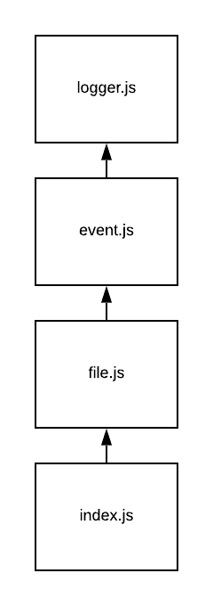

# LAB - Events

## Event Emitter

### Author: David Vloedman

### Links and Resources
* [submission PR](https://github.com/david-vloedman-401-advanced-javascript/401-lab-16/pull/1)
* [travis](https://www.travis-ci.com/david-vloedman-401-advanced-javascript/401-lab-16)

#### Documentation

[JSDocs](./docs/index.html)

### Setup

#### How to initialize/run your server app (where applicable)

npm start [fileName]
  
#### Tests

npm test

#### UML

